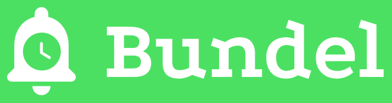

<p align="center">
  <br/>


  <a href="https://github.com/rock3r/Bundel/actions/workflows/buildbot.yml" target=_blank>
    
  </a>
  &nbsp;
  <a href="https://github.com/rock3r/Bundel/blob/main/LICENSE" target=_blank>
  
  </a>
  &nbsp;
  <a href="http://bit.ly/cwi-twitch" target=_blank>
    
  </a>
  &nbsp;
  <a href="https://twitter.com/codewiththeita" target=_blank>
    
  </a>
</p>

Bundel is a **digital wellbeing** Android app, helping you to focus by grouping up
notifications and only releasing them in batches, at set times. This minimises context
switching and improves productivity, while decreasing the impulse to continuously check
your phone.

## State of the project
The app is in its **very early dev stages**. It's likely to crash and burn at any time, it's not optimised,
it is not even an MVP (minimum viable product) for what it wants to be. It's a work in progress, and you
can expect continued development and fixes, horrible temporary design, and all those fun things we all get
through when we're prototyping something. But it will get better! Nice things just need time.

## Why this app, why open source
This project was born out of an idea [Ivan Morgillo](https://github.com/hamen) and myself had: we wanted to
learn using [Jetpack Compose](https://developer.android.com/jetpack/compose), and maybe catch up on some
other cool Android stuff. But side projects never really get completed, and at the same time, just putting
the code out there wouldn't really give much insight into the _how_ and _why_ things are done a certain way.
Open source is a great way to sharing knowledge, and this being a side project for us, that was a given. But
making the sources available in and by itself isn't enough: you miss the context, get presented with a final
solution to a largely unknown problem. Just think how many times you've wondered why some code you were
reading was done in that way and not in another!

So, we decided we'd share the _entire_ process. We stream ourselves, and some awesome guests, coding on the
app, learning as we go, making mistakes and fixing them. We've rather unoriginally named this project
**Code with the Italians**, as both Ivan and myself come from the country that brought you pizza (oh, and by
the way, you're welcome!).

This app, Bundel, is our first in this live coding project of ours — who knows what will come next.


<a href="https://twitter.com/codewiththeita" target=_blank>
  
</a>

### I want to watch y'all crazies code
The good news is, it's really easy to do! To keep up to date with all that's happening, you should
[follow @codewiththeita](https://twitter.com/codewiththeita) on Twitter. If Twitter isn't your
thing — we understand! — we also make announcements [on Telegram](https://t.me/code_with_the_italians).

We live stream [on Twitch](http://bit.ly/cwi-twitch) and [on YouTube](http://bit.ly/cwi-yt).
You can also find the whole archive of previous streams over on YouTube.

We regularly stream ourselves coding on this app. We are _generally_ live at these times:
* Wednesdays, at 18:30 CEST / 12:30 PM EST / 9:30 AM PST
* Sundays, at 17:00 CEST / 11 AM EST / 8 AM PST

Dates and times may vary though, so watch out for announcements. Or, you know, add
[this nifty iCal subscription](http://bit.ly/cwi-ical) to your calendar. You can find some instructions
[here](https://twitter.com/codewiththeita/status/1389220980506173445).

### I want to contribute
Find the [guide to contributing here](CONTRIBUTING.md)

## Acknowledgements
While ourselves, Ivan and Seb, are the two main authors of this app and the hosts of the streams,
we need to acknowledge that we're standing on the shoulders of giants.

We need to thank all our friendly guests, each bringing their invaluable experience and patience
towards our bs to the streams and app. Thank you, thank you, thank you! You folks are 💛

We also want to thank everyone that helped us behind the scenes with our oddly specific questions
and doubts, saving us countless hours of swearing and hacking away at tough problems.

Lastly, we thank everyone who's following us, watching us code, donating to the cause, and spreading
the word.  Y'all are the reason we're doing this!

<small>I know it says "lastly" right above this, but I feel we should also really thank the fine folks
at Google Developers who have done us the honour of [featuring us](https://devlibrary.withgoogle.com/products/android/repos/rock3r-Bundel)
in their brand new DevLibrary.</small>

## License
Bundel is licensed under the [Apache 2.0 license](LICENSE).

```
   Copyright 2021 the Bundel contributors

   Licensed under the Apache License, Version 2.0 (the "License");
   you may not use this file except in compliance with the License.
   You may obtain a copy of the License at

       http://www.apache.org/licenses/LICENSE-2.0

   Unless required by applicable law or agreed to in writing, software
   distributed under the License is distributed on an "AS IS" BASIS,
   WITHOUT WARRANTIES OR CONDITIONS OF ANY KIND, either express or implied.
   See the License for the specific language governing permissions and
   limitations under the License.
```
